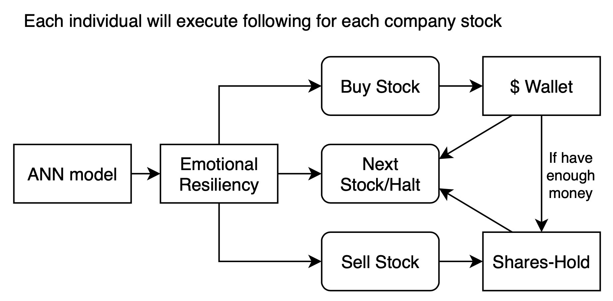
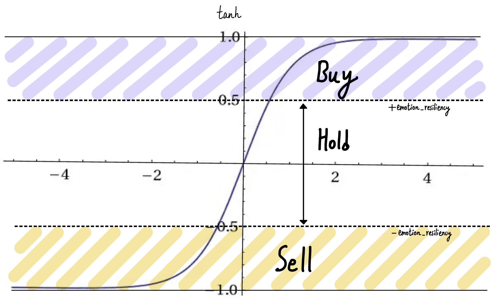

# Decide Action Phrase

- Each individual will *randomly order* the stocks and execute the action rundown
- Thus Halt if for all stocks' decision are halt

## Decision condition for Action Selection
The following graph show how each individual decide the action:

- Individual will perform
	- Hold if ANN output value $\le$ | emotion resiliency |
	- Buy if ANN output value > emotion resiliency
		- Buy Stocks with price that are lesser than $(1+|ANN\ output|) \times \;average\; of \;previous\; 30\; (tu)\; stock\; price$
	- Sell if ANN output value < -emotion resiliency
		- Sell Stocks with price $[(1+|ANN output|) \times  average\; of \;previous\; 30\; (tu)\; stock\; price] \times (1-fail\;to\;sell\;counter/10)$
		- where fail to sell counter starts at 0 and will increment by 1 each generation if no other individual purchase the stock.
		- If sell successfully, that stock's fail to sell counter reset to 0

