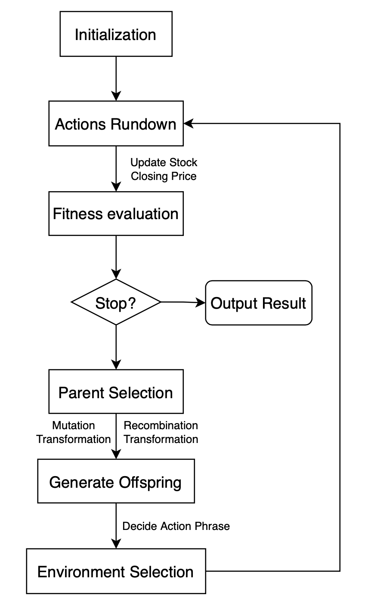

# Workflow Design

Components needed:
- Initialization
- Fitness evaluation
- Actions rundown
- Parent Selection
- Mutation Transformation
- Recombination Transformation
- Environment Selection (Survivor Selection)
- Termination Condition

**For simplicity, each generation is a time unit (tu)**
