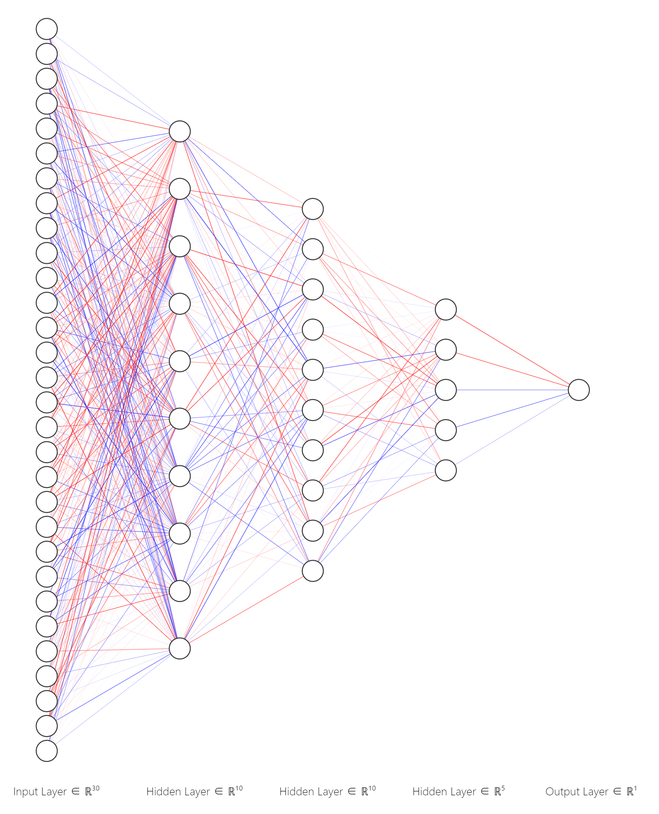
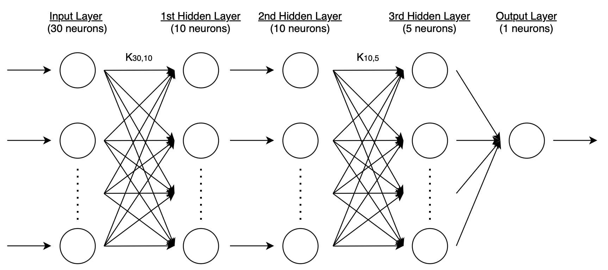

# Representation of Individual
In this simulation, individual are investors in the stock market. Each individual will be an object from class Investor
The following are the 9 properties + 1 (bonus) each individual will have:
- Name
- Wallet
- ANN model
- Emotion resiliency
- Action
- Current age
- Death age
- Shares_hold
- Journal entry
- History (Bonus)

## Wallet
It represents the liquid asset an individual has currently.
- Type(Wallet) = Floating point
- Wallet $\in [0, \infty]$
- Individual need cash inside wallet to buy shares of stocks.

## ANN model
It represents the "thinking" of each individual

- Input is previous 30 (tu) stock price of each stock
- Output value $\in [-1, 1]$
- There are 5 layers:
	- Input Layer (30 neurons)
	- Hidden Layers
		- 10 neurons ($K_{30,10}$ mapping)
		- 10 neurons (1-to-1 mapping)
		- 5 neurons  ($K_{10,5}$ mapping)
	- Output Layer (1 neurons, 5x1 mapping)

The current structure of the ANN model (mapping is wrong) is as follow:

image generated from [website](http://alexlenail.me/NN-SVG/index.html)

- There are in total of 381 variables for this ANN model
	- Input Layer (30 weights + 30 bias = 60 variables)
	- Hidden Layer (30x10=300 weights + 10 bias = 310 variables)
	- Output Layer (10 weights + 1 bias = 11 variables)

- For activation function (subject to change):
	- Use **ReLu** ($f(x)=max(0,x)$) for Input Layer, Hidden Layer
	- Use **Tanh** ($f(x)=\frac{e^x - e^{-x}}{e^x + e^{-x}}$) for the Output Layer

## Emotion resiliency
It represents the desire to purchase/sell the stocks.
It is a boundary value for each individual to decide which one of the following actions will be chosen for this generation: buy, halt (do nothing), and sell

- Type(Emotion resiliency) = Floating point
- Emotion resiliency $\in [0, 1]$
- Explanation
	- The lower, the higher chance to buy/sell the stock
	- The higher, the higher "self-control"/chance to halt

## Action
It represents the action each individual will perform in this generation
-  **k** action per generation where [[Implemented Architecture#Hyperparameters|k]] is a hyperparameter
- Type(Action) = \[Encode: Integer, (Stock: String, Price: Floating point), Transaction: Boolean\]
- Action (With encoding):
	- 0 -> Hold (Do nothing for this generation)
	- 1 -> Buy Stock
	- 2 -> Sell Stock
- Transaction is initialized as False

## Age
One of the mechanism for each individual to "die"

Each Individual will have following properties related to age:
- Current age
	- Everyone starts at 0
	- Increments by 1 after each generation
- Death age
	- Random Normal Distribution from $Normal(75, 10), \mu \;and\; \sigma$ can be adjusted
	- When current age == death age, Individual will perform last action, have a "recombination" with random $k$ individuals to equally share its assets, and remove from the population
- One of the Terminal Conditions
	- Meanwhile an individual dies, the parents will generate one more offspring (introduce new investor) to the population to maintain the population size

## Shares_hold
The amount of stocks each individual holds
- The data type for this property is dictionary
	- {"stock": \[\[First bought share price, Fail to sell counter\]\]}

## Journal entry
It represents the entire transaction (action) history of each individual throughout the entire simulation. It records the entire history of wallet, transactions, shares_hold changes.

- Type(Journal entry): \[\[\[Action, ("Stock", Price), Transaction status\] x [[Implemented Architecture#Hyperparameters|k]]\]\]
- Transaction status would be: Success (True), Failed (False)
- 1st layer Index represents the i-th generation
- 2nd layer Index represents which j-th action inside i-th generation

## History (Bonus)
It will record the entire history of emotion resiliency, ANN, actions.
